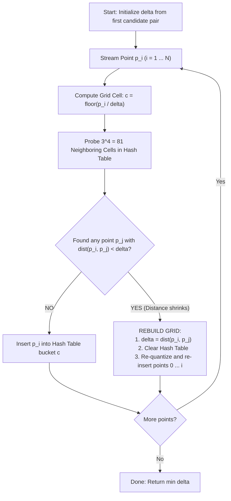

# Guide: Algorithmic Heavy Loaders, Performance Mechanics & Correlation Analysis

> [!NOTE]
> **Working Reference Document (No Final Conclusions Drawn)**
> This document details the mechanical workings of the Rabin--Seidel Closest Pair algorithm, the instrumentation code for each suspected computational loader, and the mathematical formulas for correlation analysis. All numerical values shown are **preliminary baseline observations** from initial runs and serve as hypotheses to be rigorously tested in the upcoming experimental plan.

---

## 1. The Algorithm Workflow

The algorithm computes the pair of points $(p_1, p_2)$ with minimum Euclidean distance $\delta$ in $d$-dimensional space ($d=4$ for OpenSky telemetry: latitude, longitude, altitude, time).



### Why a Hash Grid?
* Space is partitioned into hypercubes of side length $\delta$.
* Under this partitioning, no grid cell can contain more than $\mathcal{O}(1)$ points separated by $\ge \delta$.
* To verify whether an incoming point $p_i$ is within distance $\delta$ of any previously inserted point, only its own cell and adjacent cells require inspection.
* In $d=4$, the number of adjacent grid hypercubes is $3^d = 3^4 = \mathbf{81\text{ cells}}$.

---

## 2. The 6 Suspects (Candidate Computational Loaders)

To understand where execution time is distributed, we instrumented 6 candidate factors:

| Suspect # | Suspect Name | Metric Definition | Code Location |
| :---: | :--- | :--- | :--- |
| **Suspect 1** | **Rebuild Work ($W = \sum i_k$)** | Total points re-inserted into the grid across all rebuild events | [`refactored/core/closest_pair.h#L162`](file:///media/vithurshan/vithu/rand/refactored/core/closest_pair.h#L162) |
| **Suspect 2** | **Non-Empty Cell Hits** | Neighbor lookups that found occupied buckets | [`refactored/core/closest_pair.h#L131`](file:///media/vithurshan/vithu/rand/refactored/core/closest_pair.h#L131) |
| **Suspect 3** | **Distance Evaluations** | 4D Euclidean distance computations executed | [`refactored/core/closest_pair.h#L133`](file:///media/vithurshan/vithu/rand/refactored/core/closest_pair.h#L133) |
| **Suspect 4** | **Shuffle Latency** | Time taken by `std::shuffle` to permute points | [`refactored/core/closest_pair.h#L230-L234`](file:///media/vithurshan/vithu/rand/refactored/core/closest_pair.h#L230-L234) |
| **Suspect 5** | **Hash Table Size (Peak Cells)** | Maximum occupied buckets in `std::unordered_map` | [`refactored/core/closest_pair.h#L159`](file:///media/vithurshan/vithu/rand/refactored/core/closest_pair.h#L159) |
| **Suspect 6** | **Coordinate Quantization** | Operations spent computing $\lfloor p[d] / \delta \rfloor$ | `to_grid_cell()` helper |

---

## 3. Detailed Examination of Each Suspect

### Suspect 1: Rebuild Work ($W = \sum i_k$)
* **Definition:** Whenever a closer pair is detected at index $i$, the grid is cleared, and all points from $0$ to $i$ are re-quantized and re-inserted into a newly scaled grid.
* **C++ Implementation:**
  ```cpp
  // File: refactored/core/closest_pair.h, Lines 158-171
  if (rebuild) {
    result.peak_occupied_cells = std::max(result.peak_occupied_cells, grid_map.size());
    rebuild_count++;
    result.rebuild_indices.push_back(i);
    result.rebuild_work += (i + 1); // Tracks cumulative points re-hashed

    grid_map.clear();
    for (std::size_t j = 0; j <= i; ++j) {
      const auto &pj = points[j];
      grid_map[to_grid_cell<Dim>(pj, delta)].push_back(pj); // Re-inserting i points
    }
  }
  ```
* **Theoretical Mechanism & Hypothesis:**
  * Rebuilding at step $i=100$ costs 100 hash insertions. Rebuilding at step $i=1{,}000{,}000$ costs 1,000,000 hash insertions.
  * While raw rebuild count $R$ treats both events equally, $W = \sum i_k$ weights each rebuild by the actual number of insertions performed.
  * *Hypothesis to test:* Does variance in $W$ explain the majority of run-to-run timing variations?

---

### Suspect 2: Non-Empty Neighbor Cell Hits
* **Definition:** The count of neighbor probes that return an occupied bucket in `grid_map`.
* **C++ Implementation:**
  ```cpp
  // File: refactored/core/closest_pair.h, Lines 129-131
  auto it = grid_map.find(neighbor_cell);
  if (it != grid_map.end()) {
    result.non_empty_cells_hit++; // Found an occupied neighboring bucket
  }
  ```
* **Theoretical Mechanism & Hypothesis:**
  * In each insertion step, $3^4 = 81$ neighbor buckets are probed. Across $N \approx 1.28\text{M}$ points, that represents $\approx 103.7\text{M}$ probes.
  * In sparse 4D space, most neighbor cells are empty.
  * *Hypothesis to test:* How much does the frequency of non-empty cells contribute to total wall-clock time compared to probe lookups themselves?

---

### Suspect 3: Distance Evaluations
* **Definition:** The number of full 4D Euclidean distance checks:
  $$\text{dist}^2(p_i, p_j) = \sum_{d=0}^3 (p_i[d] - p_j[d])^2$$
* **C++ Implementation:**
  ```cpp
  // File: refactored/core/closest_pair.h, Lines 132-140
  for (const auto &pj : it->second) {
    result.distance_evals++; // Pairwise distance calculation
    float dist_sq = pi.squared_dist(pj);
  }
  ```
* **Theoretical Mechanism & Hypothesis:**
  * Evaluated only when a neighbor cell contains points.
  * *Hypothesis to test:* Does the arithmetic cost of distance calculations introduce measurable variation relative to memory operations?

---

### Suspect 4: Randomization Shuffle Latency
* **Definition:** The elapsed time consumed by `std::shuffle` prior to grid processing.
* **C++ Implementation:**
  ```cpp
  // File: refactored/core/closest_pair.h, Lines 230-234
  auto t_shuffle_start = std::chrono::high_resolution_clock::now();
  std::shuffle(points_copy.begin(), points_copy.end(), g);
  auto t_shuffle_end = std::chrono::high_resolution_clock::now();
  result.shuffle_time_ms =
      std::chrono::duration<double, std::milli>(t_shuffle_end - t_shuffle_start).count();
  ```
* **Theoretical Mechanism & Hypothesis:**
  * Permuting $\sim 30 - 40\text{ MB}$ of point data causes non-sequential memory writes, invalidating L1/L2 caches before the streaming pass begins.
  * *Hypothesis to test:* Does this memory traversal penalty vary significantly between multi-socket NUMA servers and unified consumer CPU architectures?

---

### Suspect 5: Hash Table Size (Peak Occupied Cells)
* **Definition:** The maximum number of occupied buckets stored in the hash table during execution.
* **C++ Implementation:**
  ```cpp
  // File: refactored/core/closest_pair.h, Lines 159 & 177
  result.peak_occupied_cells = std::max(result.peak_occupied_cells, grid_map.size());
  ```
* **Theoretical Mechanism & Hypothesis:**
  * When $N \approx 1.28\text{M}$ points occupy unique cells, the table footprint reaches $\approx 40 - 50\text{ MB}$, exceeding standard L3 cache sizes ($12 - 32\text{ MB}$).
  * If the hash table exceeds cache capacity, the 103.7M neighbor lookups incur main memory (DRAM) access latencies rather than L3 cache latencies.
  * *Hypothesis to test:* How strongly does working set size / cache spillage correlate with overall execution time across different datasets and hardware platforms?

---

### Suspect 6: Coordinate Quantization (`std::floor`)
* **Definition:** Converting continuous coordinates to discrete grid indices:
  $$c_d = \left\lfloor \frac{p[d]}{\delta} \right\rfloor$$
* **Theoretical Mechanism & Hypothesis:**
  * Executed once per dimension per streamed point, and repeated for each point re-inserted during a rebuild.
  * Represents an $\mathcal{O}(d \cdot N)$ arithmetic baseline.

---

## 4. Statistical Methodology: Correlation ($r$) and Variance Explained ($R^2$)

### Mathematical Formula
For a given metric $X$ and execution time $Y$ across $n$ runs:

$$r_{X, Y} = \frac{\sum_{i=1}^n (X_i - \bar{X})(Y_i - \bar{Y})}{\sqrt{\sum_{i=1}^n (X_i - \bar{X})^2} \cdot \sqrt{\sum_{i=1}^n (Y_i - \bar{Y})^2}}$$

Where:
* $X_i$ is the metric value for iteration $i$, with sample mean $\bar{X}$.
* $Y_i$ is the execution time for iteration $i$, with sample mean $\bar{Y}$.

### Interpretation
* **$r \approx +1.0$:** Strong positive linear relationship (as metric increases, execution time increases proportionately).
* **$r \approx 0.0$:** No linear relationship detected.
* **$r < 0$:** Inverse relationship (often indicative of background system noise when magnitudes are small).
* **$R^2 = r^2$:** Coefficient of Determination, representing the proportion of execution time variance linearly associated with that metric.

---

## 5. Preliminary Baseline Observations (Server vs. Local PC)

The following values are initial empirical measurements collected across 300 runs (150 on Datacenter Server, 150 on Local Laptop) across 5 OpenSky datasets:

| Candidate Metric | Server $r$ | Server $R^2$ | Local $r$ | Local $R^2$ | Focus for Upcoming Experiment Plan |
| :--- | :---: | :---: | :---: | :---: | :--- |
| **Rebuild Work ($\sum i_k$)** | $+0.9149$ | $83.7\%$ | $+0.9380$ | $88.0\%$ | Test across different spatial distributions and dimensionalities. |
| **Hash Table Size (Peak Cells)** | $+0.8186$ | $67.0\%$ | $+0.6271$ | $39.3\%$ | Test varying $N$ and hash table implementations (open addressing vs chained). |
| **Shuffle Latency** | $+0.8758$ | $76.7\%$ | $+0.4616$ | $21.3\%$ | Measure cache miss counters (`perf` / L3 miss rate) during shuffle. |
| **Rebuild Count ($R$)** | $+0.7599$ | $57.8\%$ | $+0.8744$ | $76.5\%$ | Compare cases where $R$ is identical but work differs significantly. |
| **Non-Empty Cell Hits** | $-0.1478$ | $2.2\%$ | $-0.1635$ | $2.7\%$ | Verify behavior in higher-density vs. lower-density clusters. |
| **Distance Evaluations** | $-0.1479$ | $2.2\%$ | $-0.1623$ | $2.6\%$ | Measure in synthetic worst-case clusters where cell density is high. |

---

## 6. How to Re-Run the Verification Script

To inspect the raw data and reproduce the preliminary correlation numbers:

```bash
/media/vithurshan/vithu/rand/.venv/bin/python3 -c "
import pandas as pd, json

def verify(csv_path, name):
    df = pd.read_csv(csv_path)
    records = []
    for _, row in df[df['Algorithm'].str.contains('Random')].iterrows():
        meta = json.loads(row['Extra_Metadata_JSON'])
        times = json.loads(row['Raw_Times_ms'])
        works = meta.get('raw_rebuild_works', [])
        hits = meta.get('raw_cell_hits', [])
        evals = meta.get('raw_dist_evals', [])
        shuffles = meta.get('raw_shuffle_ms', [0.0]*len(times))
        peak_cells = meta.get('mean_peak_cells', row['Num_Points'])
        for it in range(len(times)):
            records.append({
                'Time_ms': times[it],
                'Rebuild_Work': works[it] if it < len(works) else 0,
                'Peak_Occupied_Cells': peak_cells,
                'Shuffle_Time_ms': shuffles[it] if it < len(shuffles) else 0.0,
                'Cell_Hits': hits[it] if it < len(hits) else 0,
                'Dist_Evals': evals[it] if it < len(evals) else 0,
                'Rebuild_Count': row['Mean_Rebuilds']
            })
    rdf = pd.DataFrame(records)
    corr = rdf.corr()['Time_ms']
    print(f'=== {name} ===')
    for col in ['Rebuild_Work', 'Peak_Occupied_Cells', 'Shuffle_Time_ms', 'Rebuild_Count', 'Cell_Hits', 'Dist_Evals']:
        r = corr[col]
        print(f'{col:22s} -> r = {r:+.4f}, R^2 = {r**2*100:5.2f}%')
    print()

verify('refactored/storage/results/opensky/server_vs_local/opensky_server_benchmark_20260919.csv', 'SERVER')
verify('refactored/storage/results/opensky/server_vs_local/opensky_local_benchmark_20260919.csv', 'LOCAL PC')
"
```
